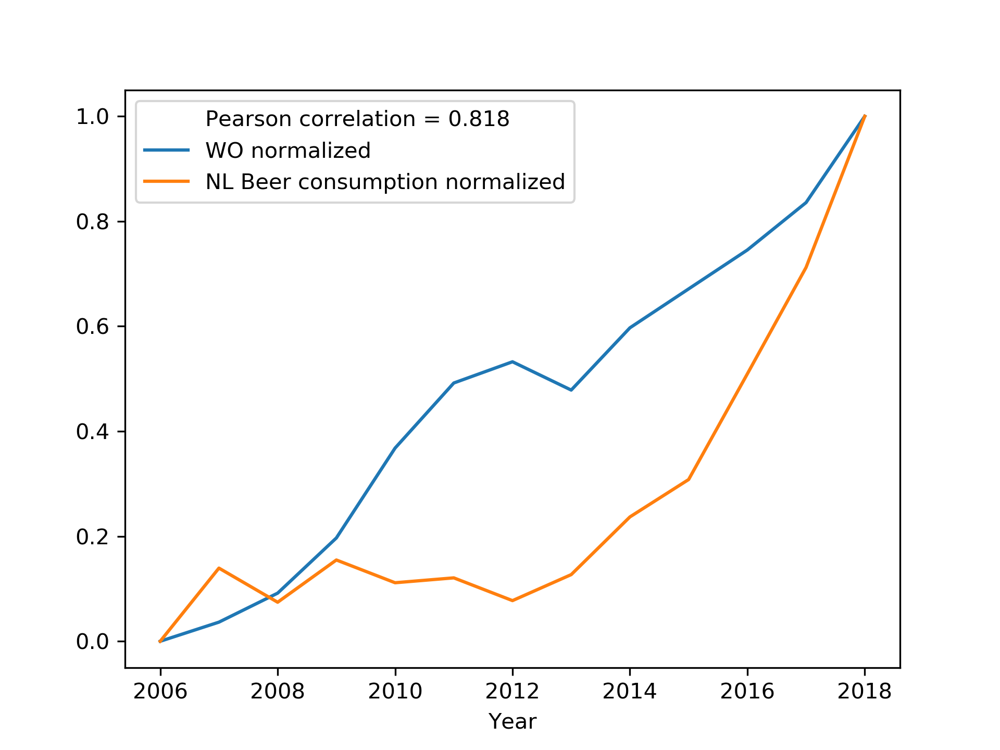

Mehmet Arkin

# Seminars CS assignment

## Titels
- MCC Van Dyke et al., 2019:
  1. Fantastic yeasts and where to find them: the hidden diversity of dimorphic fungal pathogens
  2. The Rise of Coccidioides: Forces Against the Dust Devil Unleashed

- JT Harvey, Applied Ergonomics, 2002
  1. An analysis of the forces required to drag sheep over various surfaces

- DW Ziegler et al., 2005
  1. The neurocognitive effects of alcohol on adolescents and college students

## Plot

